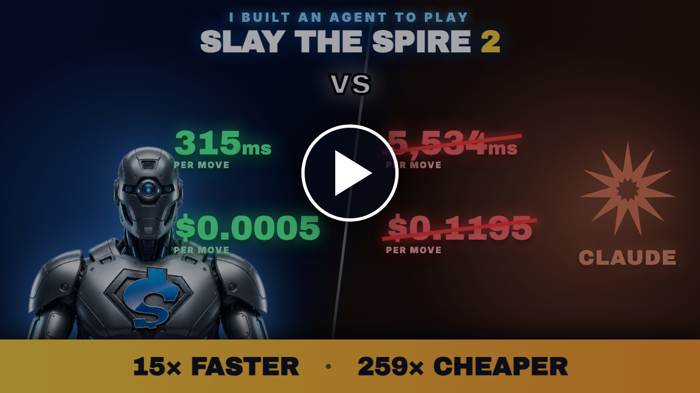
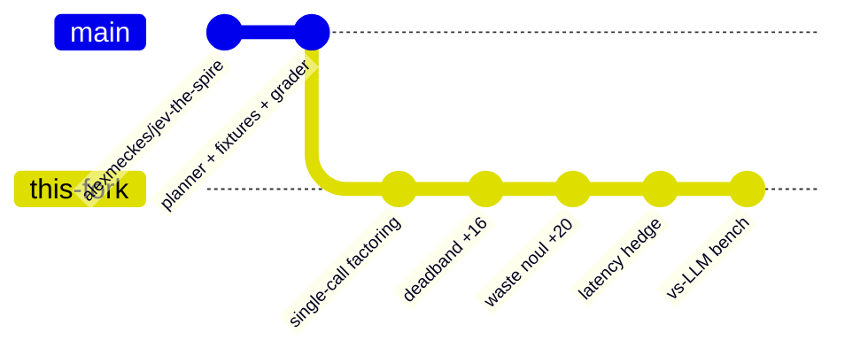
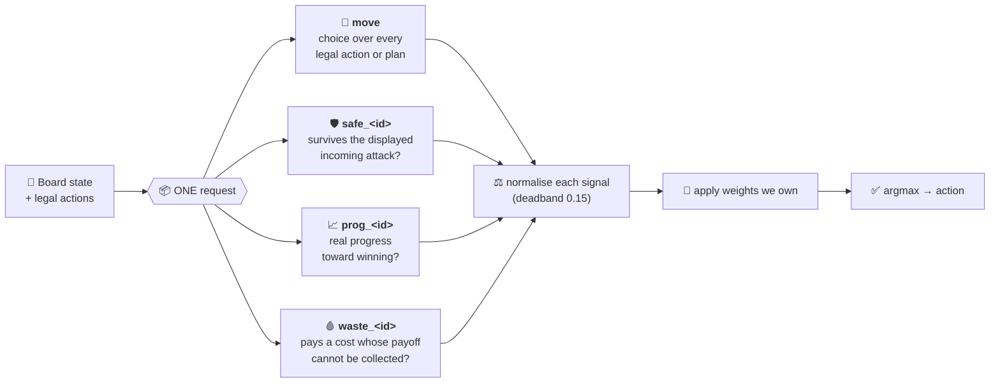
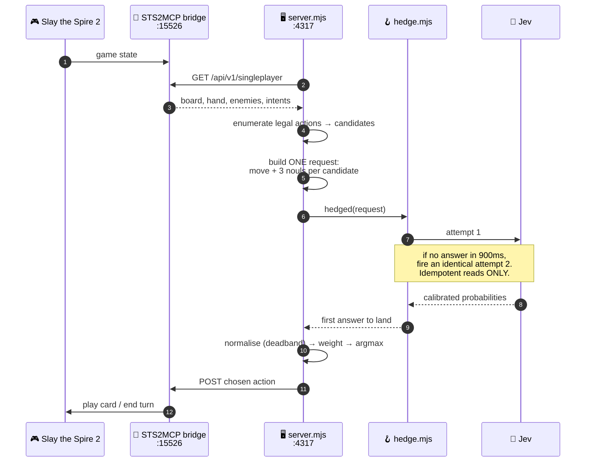

<div align="center">

# 🗡️ Jev The Spire 2

**An agent plays Slay the Spire 2 and decides every move in about 315 milliseconds for $0.00046 —
15x faster and 259x cheaper than Claude scoring the same decisions.**

[](#-the-measurements)
[](#-the-measurements)
[](#questions-are-free-round-trips-are-not)

[](#-reproduce)
[](https://nodejs.org)
[](package.json)
[](LICENSE)
[](https://github.com/alexmeckes/jev-the-spire)

### ▶️ Watch it play

[](https://youtube.com/@shoemoney)

*Click to watch on YouTube.*

</div>

---

Everything below is measured, the harness is in this repo, and the raw results are in
[`SWEEP-FINDINGS.md`](SWEEP-FINDINGS.md). **Run it yourself and disagree with me.** 🔬

---

## 🧭 Table of contents

| | | |
|---|---|---|
| 🙏 [Credit where it belongs](#-credit-where-it-belongs) | 🧠 [What the thing actually is](#-what-the-thing-actually-is) | 🔁 [One decision, end to end](#-one-decision-end-to-end) |
| 📊 [The measurements](#-the-measurements) | 🩸 [Three things that cost real time](#-three-things-that-cost-real-time-to-learn) | 🔧 [Setup](#-setup) |
| 🎮 [The game mod](#-the-game-mod) | 🚀 [Run it](#-run-it) | 📁 [Repo map](#-repo-map) |
| 🔬 [Reproduce](#-reproduce) | 📚 [Deeper docs](#-deeper-docs) | 📜 [License](#-license) |

---

## 🙏 Credit where it belongs

This is a fork of **[alexmeckes/jev-the-spire](https://github.com/alexmeckes/jev-the-spire)**
(MIT). The Slay the Spire 2 integration, the planner, the decision fixtures and the grading
suite are all his work, and this repo keeps his full commit history rather than a squashed
snapshot. What this fork adds is a different decision layer on top, plus the measurement to
show whether it was worth doing.

The game bridge is **[STS2MCP](https://github.com/Gennadiyev/STS2MCP)** by Yikun Ji.



---

## 🧠 What the thing actually is

**[TypeSafe Jev](https://docs.typesafe.ai)** is a decision model, not a chat model. You hand it
a state and a set of typed questions, and it returns calibrated probabilities. It never
generates text, so there is no prompt begging for JSON and no fence-stripping regex on the way
back. Anthropic's Kahneman framing fits: it is a System One model, fast intuitive judgment, and
it is explicitly not built for extended reasoning.

That constraint is the whole design problem. **"Which card should I play?" is a System Two
question.** So this fork decomposes it into System One questions and recombines them in code:



Every question in that request is evaluated **in parallel and in isolation**, which is the part
that makes it work. 🔑

<details>
<summary><b>⚖️ The weights, and why <code>waste</code> is a veto</b> (click to expand)</summary>

<br>

From [`spire-demo/factored.mjs`](spire-demo/factored.mjs):

```js
export const WEIGHTS = { move: 0.25, safe: 0.25, progress: 0.25, waste: 1 };
export const DEADBAND = 0.15;
const MAX_FACTORED_CANDIDATES = 64;
```

`waste` carries 4x the weight of any other factor because it is not a preference, it is a veto.
The failures it catches are self-harm and dead-setup traps — Bloodletting on an empty hand,
Fortifier, Pact's End — which the other three factors are structurally incapable of noticing.
Adding it was worth **+20 points**. See [`SWEEP-FINDINGS.md`](SWEEP-FINDINGS.md).

</details>

---

## 🔁 One decision, end to end



> [!NOTE]
> **The hedge never touches game commands.** Only the read is hedged, because firing a duplicate
> "play this card" would play it twice. That boundary is enforced in
> [`hedge.mjs`](spire-demo/hedge.mjs), not by convention.

---

## 📊 The measurements

### Questions are free. Round trips are not.

Same board, same candidates, four samples each:

| questions | input tokens | cost | median latency |
|---|---|---|---|
| 31 | 18,236 | $0.000766 | 487ms |
| 85 | 23,096 | $0.000970 | 457ms |
| **160** | 29,846 | $0.001254 | **491ms** |

**160 questions answer as fast as 31.** Tokens scale, latency does not. So a decision needing N
judgments costs **one request, not N** — and the upstream policy's 2.4 sequential calls per
decision were the entire latency problem. 🎯

### 🆚 This fork vs upstream, same graded fixtures

| policy | quality | p50 | calls per decision |
|---|---|---|---|
| upstream `deliberate` | 24/30 (80%) | 758ms | 2.40 |
| **this fork** | **90/100 (90%)** | **325ms** | **1.00** |

### 🏁 vs frontier models, byte-identical state, 30 decisions each

| | model | score | p50 | p90 | $/decision |
|---|---|---|---|---|---|
| 🥇 | `moonshotai/kimi-k3` | 29/30 | 2,312ms | 69,963ms | $0.01111 |
| 🥇 | `anthropic/claude-opus-5.5` | 29/30 | 3,590ms | 9,025ms | $0.04704 |
| 🥇 | `anthropic/claude-fable-5.1` | 29/30 | 5,534ms | 12,964ms | $0.11952 |
| 🥇 | `x-ai/grok-4.7` | 29/30 | 12,022ms | 31,624ms | $0.01303 |
| ⚡ | **`typesafe/jev-1.13`** | 27/30 | **315ms** | **585ms** | **$0.00046** |
| | `openai/gpt-6-astra` | 24/30 | 1,672ms | 3,284ms | $0.03210 |
| | `deepseek/deepseek-v4.1-flash` | 24/30 | 23,366ms | 82,839ms | $0.00446 |

> [!IMPORTANT]
> **Read this honestly.** The quality gate is a narrow first-action error check on ten fixtures.
> The grader says so itself: *"not optimality or win probability."* The noise floor on that corpus
> is about **±3**, so **27 and 29 are not separable** and Jev is **not** "smarter" than Claude here.
> What *is* separable, and by a lot, is **6x–63x on speed** and **24x–260x on cost**.

Also worth saying: **Opus 5.5 is the best LLM on this board and it is not close.** Same score as
Fable at 35% lower latency, 60% lower cost, and a far tighter tail. 👏

---

## 🩸 Three things that cost real time to learn

<details open>
<summary><b>1️⃣ A factor that did not separate the candidates still voted at full strength</b></summary>

<br>

Min-max normalising each signal fixed the scale mismatch between a choice probability and a
noul — but when every candidate scored within 0.01 of the others, it stretched that gap into a
full 0-to-1 swing. **Three factors shouting about nothing.**

A `DEADBAND` of 0.15 raw spread, below which a factor returns neutral, was worth **+16 points**
on its own.

</details>

<details>
<summary><b>2️⃣ Capping the fan-out to save money silently disabled the factoring</b> 💀</summary>

<br>

At a cap of 28 candidates, **6% of decisions exceeded it and 7% of all candidates got no factor
questions at all** — always on the busiest boards, which is exactly where you need them.

It cost a run. At **7 HP against three enemies telegraphing 17 damage**, the top three
candidates came back `safe=None prog=None waste=None` with confidence 0, and the agent died two
decisions later.

The cap is now **64** — above the largest board observed (53), with headroom under the 64k
request context.

</details>

<details>
<summary><b>3️⃣ The endpoint's latency is bimodal and it comes and goes</b> 🎭</summary>

<br>

Measured on identical payloads: a **fast cluster at 0.34–0.79s** and a **slow cluster at 7–16s**,
with nothing in between. Waiting longer never helps; issuing a second identical request does,
because it draws again. Hence [`hedge.mjs`](spire-demo/hedge.mjs).

Four hours later the slow mode was **gone entirely** and the hedge never fired across 480
decisions.

> **Never tune a timeout from one sitting.** The hedge is insurance whose value is zero while the
> service is fast and large when it is not, so the delay sits just above fast-mode p99 (~650ms)
> where it costs nothing to carry. 900ms stands.

</details>

---

## 🔧 Setup

You need **Slay the Spire 2**, **Node.js 22+**, and an
**[OpenRouter](https://openrouter.ai/keys) key**.

```bash
git clone https://github.com/shoemoney/jev-the-spire2.git
cd jev-the-spire2
```

### 🔑 Where the key goes

> [!WARNING]
> **Nothing in this repo auto-loads `.env`.** There is no `dotenv` — the dependency list is
> empty on purpose. A `.env` file sitting in the repo root is read by *nobody* unless you pass
> Node's built-in `--env-file` flag. Pick one of the two paths below; both are verified.

| | Path | How | Read by |
|---|---|---|---|
| 🅰️ | **`.private/typesafe.cfg`** *(simplest)* | `api_key = "sk-or-v1-..."` | every entrypoint, automatically |
| 🅱️ | **`.env` + explicit flag** | `cp .env.example .env`, then always launch with `node --env-file=.env ...` | only when you pass the flag |

And the two variable names are **not** interchangeable:

| variable | what actually reads it |
|---|---|
| `TYPESAFE_API_KEY` | `server.mjs` (the app you run), `benchmark/run.mjs`, `run-sequences.mjs`, `evaluate-plans.mjs` |
| `OPENROUTER_API_KEY` | `benchmark/sweep.mjs`, `benchmark/vs-llm.mjs` |

Both are the **same OpenRouter key**. Only `vs-llm.mjs` has no `.private/typesafe.cfg` fallback,
so that one genuinely needs the environment variable set.

---

## 🎮 The game mod

Install [STS2MCP](https://github.com/Gennadiyev/STS2MCP).

> [!CAUTION]
> **On Slay the Spire 2 v0.111+ the prebuilt DLL does not load.** It dies with
> `ReflectionTypeLoadException: Could not load type ...Multiplayer.LobbyPlayer`.

The compatibility fix lives in **[upstream PR #132](https://github.com/Gennadiyev/STS2MCP/pull/132)**,
which is **still open** and lives on a **fork** — so `git checkout fix/v0.111-compat` against
`Gennadiyev/STS2MCP` will not find it. Clone the fork directly:

```bash
git clone --branch fix/v0.111-compat https://github.com/DarkArcZ/STS2MCP.git
cd STS2MCP
git apply /path/to/jev-the-spire2/spire-demo/vendor/deck-state.patch
dotnet build STS2_MCP.csproj -c Release -p:STS2GameDir="/path/to/Slay the Spire 2"
```

✅ **Verified 2026-09-24:** the vendored [`deck-state.patch`](spire-demo/vendor/deck-state.patch)
applies cleanly to that branch at commit `199cf59` (one hunk, offset 7 lines).

The patch exposes the visible permanent deck for deck-building decisions. It changes observation
data, not game rules. Without it, permanent-deck context may be unavailable.

🍎 **On macOS** the mods folder lives inside the app bundle at
`SlayTheSpire2.app/Contents/MacOS/mods/`, and the game **must be launched through Steam** or
Steamworks init fails with `No appID found`.

📖 Full bridge contract, verified-build provenance, and the older v0.107.1 build notes are in
**[`docs/bridge.md`](docs/bridge.md)**.

---

## 🚀 Run it

```bash
SPIRE_BETTER_POLICY=1 node spire-demo/server.mjs   # dashboard at http://127.0.0.1:4317
```

Start a normal singleplayer run in the game, then press **Autoplay**. 🚀

<details>
<summary><b>🎛️ Every runtime flag</b></summary>

<br>

| variable | default | what it does |
|---|---|---|
| `SPIRE_BETTER_POLICY` | *unset* | `1` enables one-call screen-specific decisions, bounded encounter memory, and a calculated fatal-end-turn guard. The companion launcher enables it unless set to `0`. |
| `SPIRE_SINGLE_CALL` | *unset* | `1` enables single-call factored decisions. **Unset falls back to the upstream multi-call policy.** |
| `SPIRE_HEDGE` | `1` | `0` disables request hedging |
| `SPIRE_PLAN_BENEFIT` | *unset* | enables the plan-benefit scoring path |
| `SPIRE_ADVISER` | *unset* | `luna` runs the opt-in Luna advisory experiment ([details](spire-demo/experiment/README.md)) |
| `PORT` | `4317` | dashboard port |
| `MAX_INPUT_TOKENS` | — | stop threshold for a run |
| `MAX_DECISIONS` | — | stop after N decisions |

When both fast-policy flags are set, `SPIRE_BETTER_POLICY` takes precedence.

🍎 macOS users can also double-click **`spire-demo/Open Jev Companion.command`**, which builds the
native companion app on first run, starts the server if port 4317 is quiet, and opens it.

</details>

---

## 📁 Repo map

### 🆕 What this fork adds

| File | What it does |
|---|---|
| 🧮 [`spire-demo/factored.mjs`](spire-demo/factored.mjs) | One request carrying the broad choice plus three nouls per candidate, recombined in code with weights you own. Holds the deadband and the 64-candidate cap. |
| 🪝 [`spire-demo/hedge.mjs`](spire-demo/hedge.mjs) | Staggered request hedging for a bimodally-slow endpoint. **Idempotent reads only** — game commands are never hedged. |
| 🧪 [`spire-demo/benchmark/sweep.mjs`](spire-demo/benchmark/sweep.mjs) | Parameter sweep scoring latency against decision quality on fixed fixtures. |
| 🏁 [`spire-demo/benchmark/vs-llm.mjs`](spire-demo/benchmark/vs-llm.mjs) | Head-to-head against any OpenRouter model on byte-identical state. |
| 📤 [`tools/youtube-upload.mjs`](tools/youtube-upload.mjs) | Uploads the run video, sets metadata, attaches a thumbnail. |
| 📝 [`tools/youtube-meta.json`](tools/youtube-meta.json) | Title/description/tags as **reviewable JSON**, so the copy is diffable before anything goes public. |

### 📂 Directories

| Dir | What's in it |
|---|---|
| `spire-demo/` | The agent, the server, the dashboard, and the offline test suite |
| `spire-demo/benchmark/` | Every measurement harness in this README |
| `spire-demo/fixtures/` | The 10 graded decision fixtures |
| `spire-demo/progress-site/` | Static 182-run progress dashboard + the winning-fight replay |
| `spire-demo/experiment/` | Opt-in Jev + Luna advisory experiment (off by default) |
| `spire-demo/vendor/` | Vendored bridge API reference + `deck-state.patch` |
| `docs/` | [bridge](docs/bridge.md) · [benchmarks](docs/benchmarks.md) · [progress & token accounting](docs/progress.md) |
| `tools/` | YouTube publishing |
| `media/` | Thumbnails, outro, and their HTML sources |
| `.private/` | Your key, raw run logs, benchmark output. **Never committed.** |

<details>
<summary><b>🎬 How the media is generated</b></summary>

<br>

The thumbnails and outro are rendered from **plain HTML** — no design tool in the loop, so a copy
change is a text edit and a re-screenshot:

| Source | Renders to |
|---|---|
| `media/thumb.html` | `thumbnail-play.png` |
| `media/thumb-vs.html` | `thumbnail-vs.png`, `thumbnail-vs-play.png` |
| `media/outro.html` | `outro.mp4` (20s) |

The full upload cut (`media/shoemoney-agent-plays-*.mp4`) is **gitignored** — it is far too large
for the repo. `tools/youtube-meta.json` points at it by name; supply your own file at that path.

**Two things that bite the uploader**, both documented at the top of
[`tools/youtube-upload.mjs`](tools/youtube-upload.mjs):

- Until the Google Cloud project passes API audit, **every upload is forced private** and cannot
  be made public through the API. Not a bug in the script.
- Quota is 10,000 units/day; an upload costs ~1,600 and a thumbnail ~50 — about **six uploads a
  day**, then HTTP 403 `quotaExceeded` until midnight Pacific.

</details>

---

## 🔬 Reproduce

```bash
npm test                                                              # offline, deterministic, free
node spire-demo/benchmark/sweep.mjs --repeats=10 --only=default,waste-veto
node spire-demo/benchmark/run.mjs --scored-only --repeats=3           # upstream control
node spire-demo/benchmark/vs-llm.mjs --repeats=3 --models=anthropic/claude-opus-5.5,x-ai/grok-4.7
```

`npm test` and `npm run benchmark:dry` make **no API calls**. Everything else spends money. 💸

<details>
<summary><b>🎚️ All benchmark flags</b></summary>

<br>

| script | flags |
|---|---|
| `benchmark/sweep.mjs` | `--repeats=N` · `--only=a,b` · `--cap=N` |
| `benchmark/vs-llm.mjs` | `--repeats=N` · `--models=a,b` · `--reasoning=...` |
| `benchmark/run.mjs` | `--repeats=N` · `--dry-run` · `--scored-only` · `--fresh` · `--comparison` · `--review-only` · `--net` · `--benefits` |

And the npm scripts:

| command | does |
|---|---|
| `npm start` | launch the server + dashboard |
| `npm test` | the full offline suite |
| `npm run benchmark:dry` | build benchmark inputs, contact nobody |
| `npm run report` | decision report |
| `npm run progress` | serve the 182-run progress site on `:4390` |

</details>

> [!WARNING]
> **A warning that cost me a false headline.** Benchmarking a reasoning model with too small a
> `max_tokens` returns **empty content, not an error** — the budget goes to reasoning tokens and
> none is left for the answer. My first run scored Fable **2/10** and I nearly published *"the
> frontier model fails to emit valid JSON 80% of the time."* With an adequate budget it scored
> **46/50 with zero parse failures.** Check `usage.completion_tokens_details.reasoning_tokens`
> before believing any parse-failure rate.

---

## 📚 Deeper docs

| Doc | What's in it |
|---|---|
| 📈 [`SWEEP-FINDINGS.md`](SWEEP-FINDINGS.md) | 680 graded decisions, 11 configs, the two changes that mattered, and the known remaining failure |
| 🌉 [`docs/bridge.md`](docs/bridge.md) | Bridge contract, mod build, verified-build provenance |
| 🧪 [`docs/benchmarks.md`](docs/benchmarks.md) | What each offline and paid evaluation actually tests |
| 📊 [`docs/progress.md`](docs/progress.md) | 182 runs, token accounting, and how to rebuild the snapshot |
| 🌙 [`spire-demo/experiment/README.md`](spire-demo/experiment/README.md) | The opt-in Luna advisory experiment |

---

## 📜 License

MIT, same as upstream. See [LICENSE](LICENSE).

Slay the Spire 2 is a trademark of Mega Crit. This project is unaffiliated with Mega Crit,
Anthropic, or TypeSafe. Model names appear only to identify what was benchmarked.

---

<div align="center">

**🗡️ Built to climb. Measured to prove it. 🗡️**

*160 questions, one round trip, 315 milliseconds, and a model that never writes a word.*

</div>
