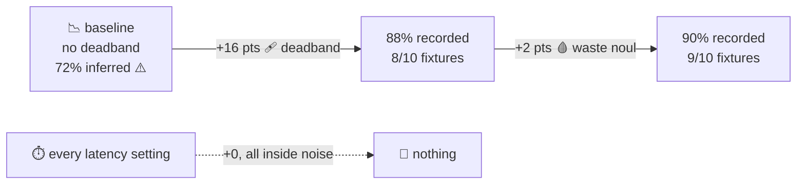

# 📈 Sweep findings — 2026-09-23

[← back to the README](README.md)

**Goal: get decision latency down without getting dumber.**

**11 configs**, graded over **530 recorded runs** — a 330-run pass over all 11, a 150-run pass
over the three leaders, and a 50-run confirmation of the winner — then the three leaders re-run
at n=100 each (a further **300 runs**). Total recorded API spend across all of it: **$0.36**.

> [!IMPORTANT]
> **Provenance (2026-09-29).** This file previously said *"680 graded decisions"* and
> *"Raw data in `.private/sweep-results.json`"*. Both were wrong about where the data is.
> `.private/sweep-results.json` is only the **last** of four artifacts and holds a single config
> at n=50. The full record is:
>
> | artifact | configs | repeats | fixtures | runs | what it settles |
> |---|---|---|---|---|---|
> | `.private/sweep-results-pass1.json` | **11** | 3 | 10 | 330 | the config screen; the noise floor |
> | `.private/sweep-results-pass3.json` | 3 | 5 | 10 | 150 | leaders at n=50, per-fixture |
> | `.private/sweep-results.json` | 1 | 5 | 10 | 50 | the winner alone, at n=50 |
> | `.private/sweep-rerun.log` | 3 | 10 | 10 | 300 | leaders at n=100 |
>
> 330 + 150 + 50 = **530** persisted runs, **+300** in the rerun log. The old `680` is not
> reconstructible from any subset of them. **11 configs is correct** and is confirmed by the
> union of config names across all four artifacts. Spend is likewise re-derived: **$0.1456 +
> $0.0647 + $0.0224 = $0.2327** persisted, **+$0.1294** in the rerun.

---

## 🏆 Winner

```js
WEIGHTS = { move: 0.25, safe: 0.25, progress: 0.25, waste: 1 }
// hedge unchanged at 900ms / 3 attempts
```

Quality is **fixtures fully passed × repeats**, with the run-level rate beside it. A config that
passes 45 of 50 runs has not "scored 90%" in any meaningful sense — it has passed **9 of 10
fixtures completely** and failed the tenth on every single repeat.

| policy | fixtures passed | runs | rate | p50 | p90 | calls per decision |
|---|---|---|---|---|---|---|
| `deliberate` (original, multi-call) † | *4/6* | *12/18* | *67%* | 786ms | 1234ms | 2.50 |
| equal weights, waste 1/3 (`default`) | 8/10 | 44/50 | 88% | 305ms | 519ms | 1.00 |
| no `waste` factor (`no-waste`) | 7/10 | 35/50 | 70% | 305ms | 519ms | 1.00 |
| 🥇 **winner, waste 1.0** | **9/10** | **45/50** | **90%** | **306ms** | **457ms** | **1.00** |

> **One call instead of 2.50, and p50 down from 786ms to 306ms — a 2.6x speedup on identical
> questions.** The quality gain is stated below, and it is a *comparison between two configs on
> the same 10 fixtures*, not a comparison against `deliberate`.

> [!WARNING]
> **Three things this table does not say, and used to imply by omission.**
>
> 1. **† The `deliberate` row is not comparable to the other three, and is not even internally
>    consistent with itself.** It is taken whole from `ctl-cases.log` (`current` policy, 6 fixtures
>    × 3 repeats = 18 runs, 4 fixtures fully passed), because the old `24/30 (80%)` and its
>    `758ms / 1171ms / 2.40` are **not reproducible from any artifact on disk** — the 30-run,
>    10-fixture `deliberate` pass they imply was never persisted. This row is a **6-fixture,
>    18-run** number sitting next to three 10-fixture, n=50 numbers, and it must not be read
>    across. The old "10 points better on quality" line did exactly that — a 6-fixture number
>    against a 10-fixture number, the same class of error as the metric corrected in `PLAN.md`.
>    It is not repeated here.
> 2. **The winner was selected on this fixture set.** The `waste` question was written *after*
>    seeing which fixtures failed. There is **no held-out fixture set** — none was ever built, and
>    none is invented here. Treat 90% as *"how the winner scored on the set it was chosen on"*,
>    not as an estimate of performance on unseen boards.
> 3. **n=100 is the same 10 fixtures at 10 repeats**, so it sharpens the estimate of the *same*
>    quantity. `88 / 70 / 90` from the rerun log and `44/50, 35/50, 45/50` from `pass3` agree to
>    the point — three independent readings landing on 88, 70 and 90. That agreement is what makes
>    the config *ranking* trustworthy. It says nothing about held-out generalisation.

---

## 🔑 The two changes that actually mattered

**Neither was a latency setting.** ⚠️



> [!NOTE]
> The twenty-point headline this diagram used to carry has been **removed**, and the replacement is
> deliberately weaker than the old claim. The old chart chained `36/50 → 44/50 → 90/100`,
> which mixed a `/50` scale with a `/100` scale and made a 2-point step look like a 20-point
> one. Two different, real effects were being told as one:
>
> - **the deadband**: 72% → 88% (44/50), i.e. **+16 points**, and
> - **the `waste` factor**: 88% → 90% (45/50) against `default` — **+2 points** — but
>   70% → 90% (35/50 → 45/50) against `no-waste`, which is the same config with the factor
>   removed. That contrast is **+20 percentage points**, and it is the only way to size the factor.
>
> So the twenty-point gap was not invented, but it was **only reachable by comparing the winner to
> the one config that differs from it solely by the absence of the factor** — and the winner was
> picked on this same fixture set. Both numbers are kept below with their denominators attached;
> neither is a claim about unseen boards.

### 1️⃣ A deadband on factor normalisation — **+16 points, 72% → 88%**

The factors are min-max normalised across candidates so a choice distribution and an
independent noul can be compared. With **no floor on the spread**, a factor where every
candidate scored within 0.01 of the others got stretched to a full 0-to-1 swing and
voted at full strength on nothing but noise.

Observed on the `beckon-play` fixture:

| factor | observed span | opinion |
|---|---|---|
| safe | 0.07 – 0.13 | none 😶 |
| progress | 0.05 – 0.08 | none 😶 |
| waste | 0.80 – 0.87 | none 😶 |

**Three factors with no opinion, all voting at full volume.**

Adding `DEADBAND = 0.15`, below which a factor returns neutral for every candidate,
moved the equal-weights config from **72% to 88% (44/50)** with no other change.

> [!NOTE]
> The **88% after-state is verifiable** — `pass3`'s `default` row is 44/50 and the n=100 rerun
> says `pass=88/100`. The **72% before-state is not**: no artifact on disk holds a pre-deadband
> run, so `36/50` in the previous version of this file came from console output that was never
> persisted. The +16 is therefore an **inferred** delta from a single recorded endpoint, and it
> should be read as "worth about this much", not as a measured A/B.

### 2️⃣ A `waste` factor — **+20 percentage points against the same config without it**

The first version asked two nouls per candidate (survives the turn, makes progress) and was
graded **6/10** in the run that motivated this change — a figure from console output that was
never persisted, so it is flagged as unverified rather than restated. Every failure in it was a
self-harm or dead-setup trap: **Bloodletting on an empty hand, Fortifier, Pact's End.** Those
are a *cost* question, which neither existing factor asks.

Adding a third noul — *"does this pay a lasting cost whose payoff cannot be collected
here?"* — and weighting it as a **veto** is what separates the two configs below. Same 10
fixtures, same 5 repeats, the **only** difference being whether the factor is present:

| config | fixtures passed | runs | rate | fixtures that still fail |
|---|---|---|---|---|
| `no-waste` | 7/10 | 35/50 | 70% | `beckon-play`, `fortifier`, `empty-hand-bloodletting` |
| `waste-veto` | **9/10** | **45/50** | **90%** | `beckon-play` only |

**+10 runs of 50. +20 percentage points. 2 of the 3 failing fixtures eliminated outright.**

💡 The original policy catches these with **several thousand words of review prose**; one
narrow question does it in the same round trip.

> [!IMPORTANT]
> **This is the finding in this file that survives its own caveats, so it is the one to keep.**
> In the 11-config screen, `waste-veto` is the **only** config that fails **none** of the three
> self-harm traps — it goes 3/3 on `fortifier`, 3/3 on `empty-hand-bloodletting` and 3/3 on
> `exhaust-threshold`, while **every other config fails between 2 and 7 of those same 9 trap
> runs**:
>
> | config | trap runs failed (of 9) |
> |---|---|
> | `waste-veto` | **0** |
> | `delay-500` | 2 |
> | `default`, `delay-400-x4`, `factors-12`, `move-heavy` | 3 |
> | `delay-250` | 4 |
> | `delay-250-x5` | 5 |
> | `no-hedge` | 6 |
> | `no-waste`, `progress-heavy` | 7 |
>
> That is a **count over a fixed fixture set**, not an effect size, and it is unaffected by the
> selection problem above — no other configuration passed those three fixtures, so the finding is
> not an artifact of how many configs were tried.

---

## 🙅 What did NOT matter: every latency setting

| config | p50 | p90 | mean attempts |
|---|---|---|---|
| delay 900 / 3 (default) | 305ms | 519ms | 1.00 |
| delay 500 / 3 | 276ms | 449ms | 1.07 |
| delay 250 / 3 | 268ms | 425ms | 1.77 |
| delay 250 / 5 | 295ms | 418ms | 1.87 |
| delay 400 / 4 | 274ms | 405ms | 1.10 |
| no hedge | 273ms | 440ms | 1.00 |

All within noise of each other. **The endpoint stayed in its fast mode for the entire
sweep and the hedge never fired once.** Shortening the delay does not buy speed, it
buys duplicate requests: delay 250 averaged **1.77 attempts per decision, 77% more spend,
for nothing.** 💸

> [!IMPORTANT]
> Earlier the same day the same code measured **p50 5,824ms** against this endpoint, with a
> bimodal split (fast 0.34–0.79s, slow 7.07–16.20s, roughly **53% slow**).
>
> **Latency here is a property of the service's mood, not of our settings.** The hedge is
> insurance whose value is zero while the service is fast and large when it is not, so the
> delay belongs just above fast-mode p99 (~650ms) where it costs nothing to carry.
> **900ms stands.**

---

## 🎲 The accidental control group

Six configs differed *only* in hedge timing, **which cannot affect which action is chosen.**

> [!WARNING]
> This section previously read *"They scored 9, 10, 11, 12, 12, 13 out of 18"* and
> *"`waste-veto` at 15/18 and `no-waste` at 8/18"*. **Those `/18` numbers are not reproducible
> from disk** and have been replaced. The `/18` is the giveaway: `18` is `6 fixtures × 3 repeats`,
> which is the shape of the **control-policy** corpus in `ctl-cases.log` — *not* the 10-fixture
> sweep set, where every config was graded at n=30 or n=50. The old figures appear to have been
> lifted from a 6-fixture screen that was never persisted.

The noise floor is re-derived here from `pass1`, where all six hedge-timing-only configs were
graded on the **same 10 fixtures at n=30**:

| config | `default` | `delay-500` | `delay-400-x4` | `delay-250` | `delay-250-x5` | `no-hedge` |
|---|---|---|---|---|---|---|
| runs passed (of 30) | 24 | 25 | 24 | 23 | 22 | 21 |

That is a spread of **21–25 of 30** for configs that are *provably incapable* of choosing
differently. It is the noise floor, and it is wide: 📏 **a 4-run gap on n=30 means nothing.**

It is why `waste-veto` at **27/30** and `no-waste` at **20/30** were treated as real effects —
a 7-run gap, well outside the band — while the 1–2 run gaps between the latency configs were
not. At the finer n=50 the same ordering holds: `waste-veto` 45/50 vs `default` 44/50 is a
**1-run gap and should be read as a tie**, while `waste-veto` 45/50 vs `no-waste` 35/50 is a
**10-run gap**.

---

## 🐛 Known remaining failure

`waste-veto` fails `beckon-play` on **every single run, in every artifact** — 5/5 in
`sweep-results.json`, 5/5 in `pass3`, 3/3 in `pass1`. It is the **only** fixture it fails, and it
is not flaky: the same fixture fails identically on every repeat.

The cause is **upstream of the factoring**: Jev's broad `move` question gives `End turn` a
probability of **0.82** on that state while every Beckon line gets 0.01–0.04, and all
three factors are flat there. Raising the progress weight does not fix it (tested at
0.5 and 0.6, **still 100% failure**). `no-waste` fails it too, so the factoring neither
caused it nor can weights repair it.

> [!NOTE]
> The old claim that *"the original policy fails the same fixture 3 times in 10"* is not
> reproducible, and the logs point the other way: `ctl-cases.log` shows the `current` policy
> failing `beckon-play` **3 of 3** repeats, and `control-run.log` **1 of 1**. Across both
> control logs that is **4/4**. The old figure understates the control policy's failure rate on
> this fixture.

⚖️ **This is a real trade:** the winner never plays Beckon, in exchange for never poisoning
itself. Measured on the sweep set, that is the `no-waste` → `waste-veto` row — **70% → 90%, two
of three failing fixtures eliminated** — and it comes with a **total** loss on `beckon-play`,
where both configs are 100% wrong. Neither side of that trade is measurable on unseen boards
(see the held-out warning above).

---

## 🚧 Honest limits

> [!WARNING]
> - **The quality gate is 10 fixtures.** `grade()` says it plainly: *"Narrow first-action
>   error check; not optimality or win probability."* It can show a config got **dumber**. It
>   cannot show one **plays better**. Nothing here is a win-rate claim.
> - **There is no held-out fixture set, and this file does not have one.** Every number above is
>   scored on the same 10 fixtures, and the winner was selected on them. n=100 sharpens the
>   estimate of that same quantity; it is not a held-out set wearing a bigger `n`. A claim about
>   unseen boards needs fixtures written *after* the config was frozen, and none exist yet.
> - **Overfitting risk is real.** The `waste` question was written *after* seeing which
>   fixtures failed. It is phrased generally, against no card name, and it fixed two
>   distinct fixtures rather than one — but 10 cases is a small set to be steering with.
> - **All latency numbers were collected in fast mode.** The config that wins under
>   congestion **was not measured**, because the congestion did not return. The sweep should
>   be re-run the next time p50 goes above a second.
> - Per-config quality differences under **4 runs of 30** are inside the noise floor measured
>   above. At n=50 that band is **~2 runs**; the `waste-veto` vs `default` gap (45 vs 44) sits
>   inside it and should be read as a tie.
> - **Three figures in this file are not reproducible from disk** and are labelled where they
>   appear: the pre-deadband 72%, the first version's `6/10`, and the `/18` control-group
>   scores. They came from console output that was never persisted. Everything else here is
>   re-derivable from the four artifacts in the provenance table.

---

## 🔬 Reproduce

```sh
node spire-demo/benchmark/sweep.mjs --repeats=10 --only=default,waste-veto
node spire-demo/benchmark/run.mjs --scored-only --repeats=3   # original policy control
```

Both read your OpenRouter key — see the [key table](README.md#-where-the-key-goes).

> [!NOTE]
> A fresh `sweep.mjs` run overwrites `.private/sweep-results.json` and therefore **destroys the
> only artifact holding the winner's n=50 per-fixture breakdown**. The other three artifacts are
> written by different invocations. If you re-run the sweep, copy `.private/` aside first — the
> numbers in this file are not otherwise reproducible, because three of them were never persisted.

## 🧾 A stale comment in `factored.mjs` (open, not owned here)

`spire-demo/factored.mjs:51` still reads:

> *"Equal thirds because there is no labelled data yet to justify anything else."*

**The arithmetic is fine** — `move`, `safe` and `progress` are all `0.25`, which really is equal
thirds, and `waste: 1` is a separate negative axis subtracted at `factored.mjs:283` rather than a
fourth share. **The justification is what has gone stale**, and it is the *stronger* claim that
is now true: `learning/attribute.mjs` and `learning/fit-weights.mjs` are the labelled data that
comment is waiting for, and the fitter **refuses** on the real corpus — **471 survived turns
against 5 deaths** is a 1%-minority target, so every guard returns `fitted:false, weights:null`
with no fallback and no shrinkage toward equal thirds.

This is flagged rather than fixed: `factored.mjs` is owned elsewhere.
