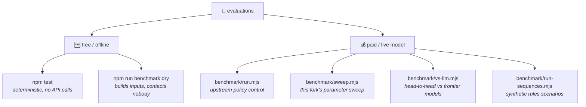

# 🧪 Evaluations

[← back to the README](../README.md)

Two kinds of harness live here: **free and offline**, or **paid and talking to a model**. Know
which one you are running before you run it. 💸



---

## 🆓 Free and offline

| command | what it does |
|---|---|
| `npm test` | Deterministic, local, **zero model API calls** |
| `npm run benchmark:dry` | Builds benchmark inputs without contacting TypeSafe |

---

## 💰 Paid evaluations

These make **real, billed calls**. Key resolution differs per script — see the
[key table in the README](../README.md#-where-the-key-goes).

### This fork's harnesses

```sh
node spire-demo/benchmark/sweep.mjs --repeats=10 --only=default,waste-veto
node spire-demo/benchmark/run.mjs --better --fresh --repeats=3
node spire-demo/benchmark/vs-llm.mjs --repeats=3 --models=anthropic/claude-opus-5.5
```

| script | reads key from | flags | writes to |
|---|---|---|---|
| `sweep.mjs` | `OPENROUTER_API_KEY`, else `.private/typesafe.cfg` | `--repeats=N` `--only=a,b` `--cap=N` | `.private/sweep-results.json` |
| `vs-llm.mjs` | `OPENROUTER_API_KEY` **only** — no cfg fallback | `--repeats=N` `--models=a,b` `--reasoning=...` | `.private/vs-llm-results*` |

📈 **`sweep.mjs` scores latency against decision quality** across named configs on the fixed
fixtures. Its 680-decision output is written up in [`SWEEP-FINDINGS.md`](../SWEEP-FINDINGS.md).

🏁 **`vs-llm.mjs` runs any OpenRouter model against byte-identical state**, so the comparison is
of decisions rather than of prompts.

> [!WARNING]
> Benchmarking a **reasoning model** with too small a `max_tokens` returns **empty content, not an
> error** — the budget is consumed by reasoning tokens with none left for the answer. Check
> `usage.completion_tokens_details.reasoning_tokens` before believing any parse-failure rate.

### Upstream harnesses

```sh
node spire-demo/benchmark/run.mjs
node spire-demo/benchmark/run.mjs --fresh --repeats=3
node spire-demo/benchmark/run.mjs --comparison --scored-only --repeats=3
node spire-demo/benchmark/run-sequences.mjs
```

These read `TYPESAFE_API_KEY`, falling back to `.private/typesafe.cfg`.

`--better` compares the existing fast policy with the contextual fast policy on
the same recorded states. Add `--fresh` for the separate immediate-survival cases.
Use `--only=deck-reward` for one named case. These are first-action checks, not
complete-run results.

🔁 **Recorded-state tests** compare the current policy with a simpler two-pass policy.
`--comparison` tests an experimental action-versus-end-turn summary. These experiments **do not
change the live policy and send no commands to the game.**

🧮 **Sequence tests** use small, explicitly synthetic scenarios, an independent rules evaluator,
and a fresh Jev decision after each action. They test Flex before attacks, Speed before block,
and Bash before Strike. **They are not full-game simulations.**

---

## 🛑 Spend guards

| harness | input-token stop threshold |
|---|---|
| recorded tests (`run.mjs`) | **2,000,000** |
| sequence tests (`run-sequences.mjs`) | **1,500,000** |

⚠️ One in-flight call can exceed the threshold — it is a stop, not a hard cap.

Results, model responses, source snapshots and usage are written under
`.private/spire-benchmark/`. Nothing in `.private/` is ever committed.

---

## 🚧 Honest limits

> [!IMPORTANT]
> Fixtures contain selected gameplay observations and prior context — not private credentials or
> complete session logs.
>
> **Passing a narrow check does not imply optimal play, a rescued run, or an improved win rate.**
> These are small development suites, not a representative held-out benchmark. The corpus is
> 10 fixtures and its noise floor is about ±3; see
> [`SWEEP-FINDINGS.md`](../SWEEP-FINDINGS.md#-the-accidental-control-group) for how that floor
> was measured.
