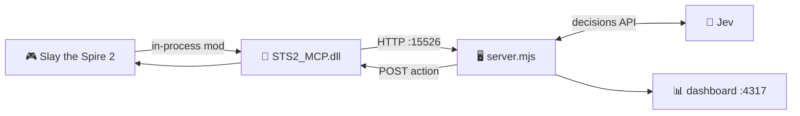

# 🌉 Game bridge

[← back to the README](../README.md)

Jev The Spire talks **directly to STS2MCP's HTTP API**; the optional MCP server is not required.
Install [STS2MCP](https://github.com/Gennadiyev/STS2MCP) separately — this repository ships
neither a bridge binary nor game assemblies.

The bridge must expose:

```
http://127.0.0.1:15526/api/v1/singleplayer
```

🔍 **Check that URL with the game running before starting autoplay.** If it does not answer, the
mod did not load, and nothing downstream will work.



---

## 🛠️ Building the mod

> [!CAUTION]
> **On Slay the Spire 2 v0.111+ the prebuilt DLL does not load.** It dies at startup with
> `ReflectionTypeLoadException: Could not load type ...Multiplayer.LobbyPlayer`.

The compatibility fix is **[upstream PR #132](https://github.com/Gennadiyev/STS2MCP/pull/132)**.
As of 2026-09-24 that PR is **still open**, and the branch lives on a **fork** — so
`git checkout fix/v0.111-compat` against `Gennadiyev/STS2MCP` will not find it. Clone the fork:

```sh
git clone --branch fix/v0.111-compat https://github.com/DarkArcZ/STS2MCP.git
cd STS2MCP
git apply /path/to/jev-the-spire2/spire-demo/vendor/deck-state.patch
dotnet build STS2_MCP.csproj -c Release -p:STS2GameDir="/path/to/Slay the Spire 2"
```

✅ **Verified 2026-09-24:** [`deck-state.patch`](../spire-demo/vendor/deck-state.patch) applies
cleanly to that branch at commit `199cf59` — one hunk, offset 7 lines. The branch does **not**
already expose the deck, so the patch is still needed there.

Install the resulting `bin/Release/net9.0/STS2_MCP.dll` alongside upstream's `mod_manifest.json`
(renamed `STS2_MCP.json`), following upstream installation instructions.

| ⚠️ | Gotcha |
|---|---|
| 🍎 | On macOS the mods directory is **inside the app bundle**: `SlayTheSpire2.app/Contents/MacOS/mods/` |
| 🎮 | The game **must be launched through Steam**, or Steamworks init fails with `No appID found` |
| 🔒 | **Quit the game** before replacing its mod files |
| 🧩 | Enable mods in the game, and use a normal singleplayer run — compatibility with other gameplay mods is not established |

---

## 🃏 The deck-state patch

The optional [deck-state patch](../spire-demo/vendor/deck-state.patch) exposes the visible
permanent deck for deck-building decisions. It is a **one-line addition** to the state builder:

```c#
state["deck"] = BuildPileCardList(player.Deck.Cards, PileType.Deck);
```

It changes **observation data, not game rules**. Without it, `deck_assessment` reports
`available:false` — and the card-reward request then **states the gap** and judges the offer
from what is visible (the card's own text, relics, potions, HP, energy, observations) instead
of pointing the model at a deck it cannot see. That unavailability is data, not a verdict: the
agent is told the deck is missing and is explicitly not to read the absence as an empty or weak
deck, so an unpatched build still takes a card when one fills a visible need.

---

## 📜 Historical: the build used for the first win

> [!NOTE]
> This section is **provenance for the September 23, 2026 winning run**, kept because that run's
> numbers are published. It is **not** current build instructions — this build targets game
> **v0.107.1** and will hit the `LobbyPlayer` load failure on v0.111+. Build from the section
> above instead.

Checked September 23, 2026: the installed mod DLL and local Release build were byte-identical.
The build checkout was upstream `55e064850a68f3b4cde7e5fd525bf9b2dec4e885` plus exactly the
vendored `deck-state.patch`, rebuilt with .NET 9 against local game assemblies. The repository
patch matched the local source diff.

> [!WARNING]
> **The deck half of that claim is contradicted by the run's own log.** All 779 records of
> `2026-09-23T20-41-11.451Z.jsonl` were checked: 775 carry a `state.player`, and
> `state.player.deck` is present in **zero** of them — including **all 27** `card_reward`
> records — while `state.player.gold` is present in **all 775**. The vendored patch inserts its
> one line immediately above `state["gold"] = player.Gold;`, so the patch's context line is
> present in the binary that produced this log and the line the patch adds is absent. **That
> binary did not include `deck-state.patch`.**
>
> This is the bridge omitting the key, not this repository dropping it: the session log records
> the bridge payload as received, and the only place the request path removes a raw
> `player.deck` is [`compact-request.mjs`](../spire-demo/compact-request.mjs), which does so
> *after* replacing it with the `state.deck` snapshot — and `state.deck.available` is `false` in
> the same run, so there was no snapshot to strip in favour of.
>
> **What cannot be determined from here — and is not guessed below:** which binary that was, or
> why. No DLL is vendored, so the SHA-256 cannot be recomputed and no build manifest records
> which patch was applied. The log cannot distinguish a patch never applied to the source
> compiled that day, one applied and then reverted, a stale DLL left installed from an earlier
> build, or a run driven from a different machine than the one that was checked. The September
> 23 checks recorded a conclusion, not their evidence, so the byte-identical-DLL and
> patch-matches-local-diff assertions can no longer be re-verified even though the log
> contradicts the outcome they supported.
>
> The corrected reading of this run: it was played **without** permanent-deck context, so its
> published numbers are a deck-blind result and say nothing about the patched build's ceiling.

DLL SHA-256: `a5bebf899d3ce0f0c788f9bd14a0a1e1b368e2e0cf08434b4b3684245dbf9886`

*(Provenance for that specific build; rebuilding on another SDK need not produce an identical
binary.)*

The earlier 0.4.0 binary had failed because `CombatManager.IsPlayPhase` had changed — the same
class of breakage as the v0.111 `LobbyPlayer` failure. **Expect the bridge to break on game
updates and plan to rebuild.**

---

## 📖 API contract

The vendored [API reference](../spire-demo/vendor/api-reference.md) documents the bridge contract
used during development. Upstream and game versions may differ — treat it as a snapshot, not a
spec.

🧊 Nothing in the progress visualizer requires running or changing the mod.
