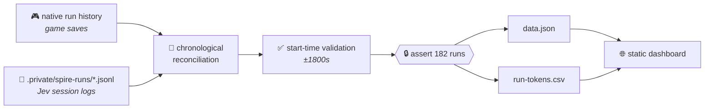

# 📊 Progress and token accounting

[← back to the README](../README.md)

The static visualizer under `spire-demo/progress-site/dist` contains the **182 completed runs**
through the **first verified victory on September 23, 2026**. 🏆

Native game-history outcomes are reconciled chronologically with private Jev session logs. The
untouched Ascension 1 run and offline experiments are excluded.



---

## 🔢 Recorded usage

| metric | value |
|---|---|
| 📥 Input tokens | **1,086,755,296** |
| 📤 Output tokens | **41,278,058** |
| 🧮 Combined | **1,128,033,354** |
| 📈 Mean input per run | 5,971,183 |
| 📊 Median input per run | 5,413,858.5 |
| 📏 Input range per run | 777,710 – 19,367,328 |
| 🗳️ Decision entries | 58,588 |
| 🏆 **Winning run #182** | **19,367,328 in + 565,987 out = 19,933,315 total** |

📄 [Every run in CSV](../spire-demo/progress-site/dist/run-tokens.csv).

### 💵 Estimated cost

At the published price checked September 23, 2026 — **$0.042 per million input tokens, output
free** ([source](https://docs.typesafe.ai/models)):

| | estimate |
|---|---|
| All 182 runs | **$45.64** |
| Average per run | **$0.25** |
| The winning run | **$0.81** |

The page and CSV include these estimates.

> [!NOTE]
> **How the counting works, and what it misses.**
>
> - ✅ All 58,588 decision entries contain input usage.
> - ✅ Each decision's `usage` **already aggregates** its assessment, review, and any extra
>   review passes, so those are counted **once**, not twice.
> - ✅ Logged previews, cancellations and stale decisions still used tokens and **are included**.
> - ⚠️ Successful calls in a pipeline that later failed or was interrupted may have **no
>   decision entry and may be missing**.
> - 🚫 Offline API evaluations and the brief Luna adviser's tokens are **excluded**; Jev calls
>   in that assisted run remain **included**.
>
> **These are recorded usage totals, not a provider billing statement.**

---

## 🔁 Rebuild the snapshot locally

Requires **Python 3.9+** and the original private evidence. Raw logs and native saves are
deliberately **not** included in this repository. 🔒

```sh
python3 spire-demo/build-progress-data.py --history-dir "/path/to/modded/profile2/saves/history"
npm run progress        # serves dist/ on http://127.0.0.1:4390
```

The generator reads `.private/spire-runs/*.jsonl`, matches them against native history in
chronological order, validates session start times, and writes `data.json` and `run-tokens.csv`.

> [!IMPORTANT]
> It **intentionally asserts the 182-run snapshot size** (`assert len(rows)==len(native)==182`).
> Adding new runs requires reviewing the pairing and updating the chart's fixed snapshot labels —
> the assertion is there so the snapshot cannot drift silently.

It exports **no** credentials, account IDs, seeds or raw prompts.

---

## 🌐 Website source

The site is plain HTML/CSS/JavaScript with **no build dependencies**. Serve
`spire-demo/progress-site/dist` with any static server.

Its separate managed Sites checkout is mirrored here as ordinary files, without a nested Git
repository or owner-specific hosting manifest. The hosted site keeps its existing private access;
cloning this repository lets anyone view the sanitized snapshot locally.

### 🎞️ The winning replay

`winning-replay.json` holds **49 recorded decisions** from run #182, exported with:

```sh
python3 spire-demo/build-winning-replay.py --log /path/to/winning-run.jsonl
```

Only selected visible game fields and recorded choice weights are published; the source log
remains private.

> [!WARNING]
> **Choice weights are not win probabilities.** Outcomes come from the next logged observation,
> **not a simulation**.

---

## 🚧 Reading the chart honestly

Strategy dates indicate **first observed policy use** or explicitly labeled report times.

These runs differ in random outcomes, unlocks **and** policy, so **the chart does not establish
which change caused improvement.** 📉📈

For the one comparison that *was* controlled — same fixtures, byte-identical state — see
[`SWEEP-FINDINGS.md`](../SWEEP-FINDINGS.md).
